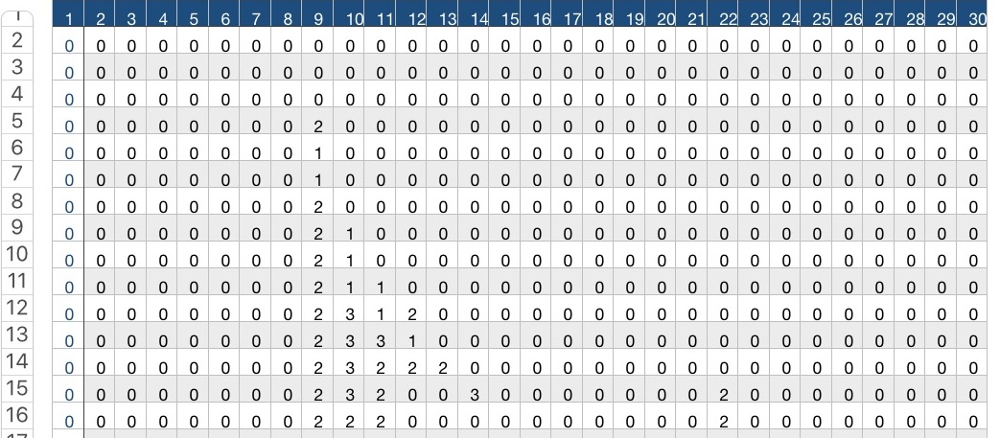

# README 

### image2stitch
A mini-project to make images into knitting pattern colour charts.

## The back-story
Some time in 2012 or 2013, my then-roommate went to Blizzcon. I was just learning to knit, and I was also very much into learning how to four-gate (I wasn't very skilled at Starcraft). Long story short, I created a zerg colour chart, and knitted a sweater for Manfred, Starcraft caster Day9's stuffed rabbit toy. The pattern I made is here: [link](https://www.ravelry.com/patterns/library/zerg-starcraft-colour-chart) My roommate gave the sweater to Day9 at blizzcon:

But what if you are not a zerg player, like Manfred?

We can output a knitting chart for that looks like this:

This repo has a few ideas on to automate the process of creating knitting colour charts from images. Next steps: A front end?
